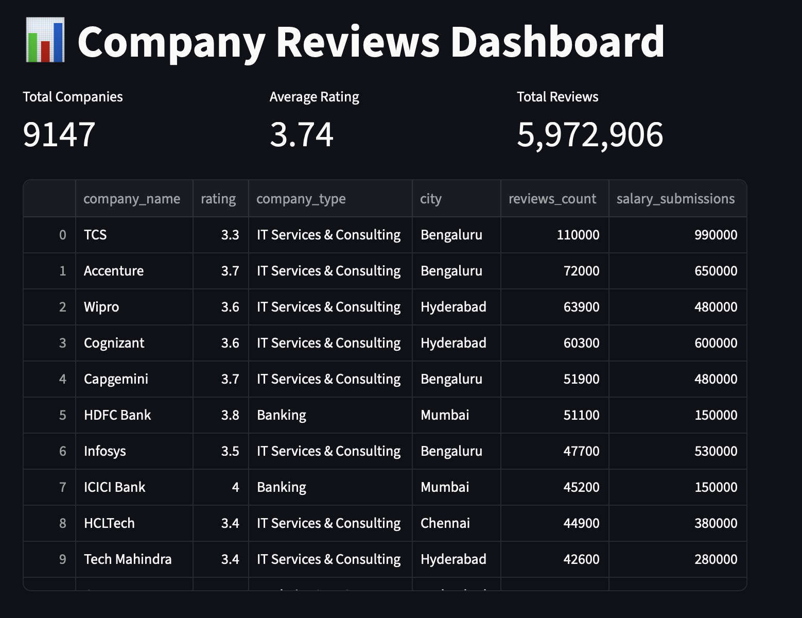
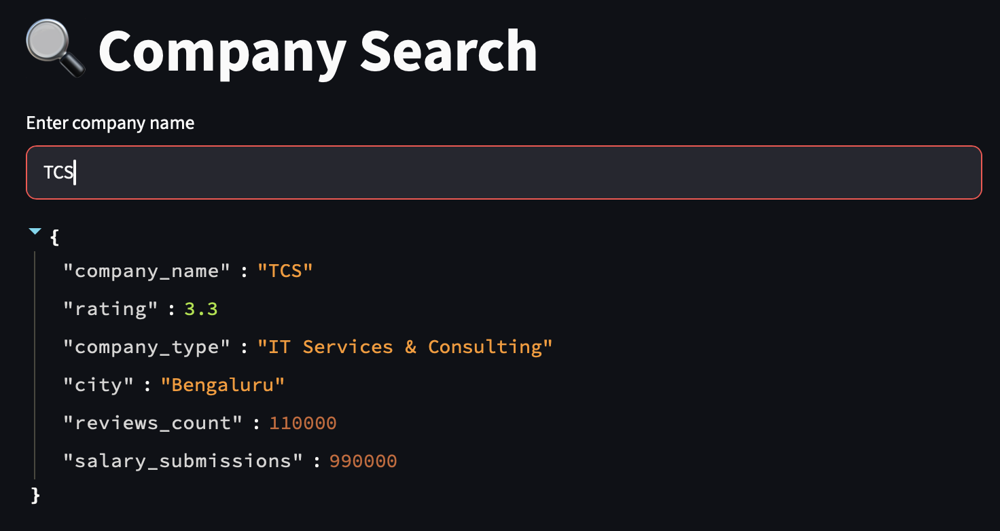
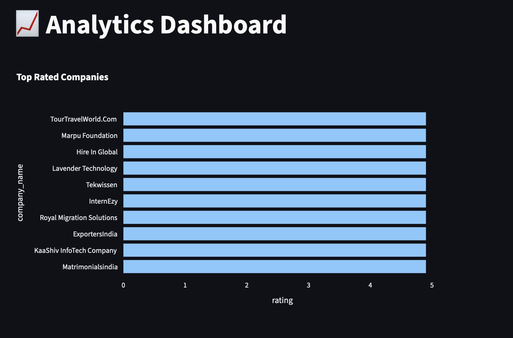

# Company Reviews Analytics Platform

## Overview

The Company Reviews Analytics Platform is an end-to-end data analytics project built using Python, PostgreSQL, FastAPI, Streamlit, Docker, and Render.

The project processes company review data, stores it in a PostgreSQL database, exposes analytical insights through a REST API, and presents the results in an interactive Streamlit dashboard.

The goal of the project was to demonstrate data cleaning, database design, API development, cloud deployment, and dashboard creation within a single analytics solution.

## Live Demo

Dashboard:
[https://company-reviews-dashboard.onrender.com]

API Documentation:
[https://company-reviews-api.onrender.com/docs]

## Architecture

CSV Dataset
    ↓
Data Cleaning (Pandas)
    ↓
PostgreSQL Database
    ↓
FastAPI Backend
    ↓
Streamlit Dashboard

## Features

- Search companies by name
- View top-rated companies
- Identify the most-reviewed companies
- Explore company ratings by city
- Filter companies by minimum rating
- Interactive dashboard visualizations
- REST API for analytical queries
- PostgreSQL-backed data storage

## API Endpoints

| Endpoint | Description |
|-----------|------------|
| GET /companies | Retrieve all companies |
| GET /companies/{company_name} | Search for a company |
| GET /top-rated-companies | Retrieve top-rated companies |
| GET /most-reviewed-company | Retrieve most reviewed company |
| GET /top-review-cities | Retrieve cities with the most reviews |
| GET /companies-by-city/{city} | Retrieve companies within a city |
| GET /companies-filter | Filter companies by rating |

## Tech Stack

### Data Processing
- Python
- Pandas

### Database
- PostgreSQL
- SQLAlchemy

### Backend API
- FastAPI
- Pydantic

### Dashboard
- Streamlit

### Deployment
- Docker
- Render

### Version Control
- Git
- GitHub

## Skills Demonstrated

- Data Cleaning with Pandas
- SQL Query Development
- PostgreSQL Database Management
- REST API Development with FastAPI
- Docker Containerization
- Cloud Deployment with Render
- Dashboard Development with Streamlit
- Git Version Control

## Dashboard Screenshots

### Home Page



### Search Page



### Charts Page



## Future Improvements

- Automated data refresh pipeline
- User authentication
- Additional visualizations
- Advanced company filtering
- Historical trend analysis

## Installation

Clone the repository:

```bash

git clone https://github.com/pheko49/company-reviews-project.git

cd company-reviews-project

Create and activate a virtual environment:

python -m venv .venv

# Windows
.venv\Scripts\activate

# Mac/Linux
source .venv/bin/activate

Install dependencies:

pip install -r requirements.txt

Create a .env file and add:

DB_HOST=your_host
DB_PORT=5432
DB_NAME=your_database
DB_USER=your_user
DB_PASSWORD=your_password
API_URL=http://127.0.0.1:8000

Run the API:

uvicorn src.api.main:app --reload

Run the dashboard:

streamlit run src/dashboard/app.py

---

Since you've Dockerized the project, you can also add a shorter Docker section:

```
## Docker

Build the image:

```bash
docker build -t company-reviews-dashboard .

Run the container:

docker run -p 8501:8501 company-reviews-dashboard


## Author

Pheko Mantlhasi

- [LinkedIn](https://www.linkedin.com/in/ferdinand-m-56a4b4107/)

- [GitHub](https://github.com/pheko49)